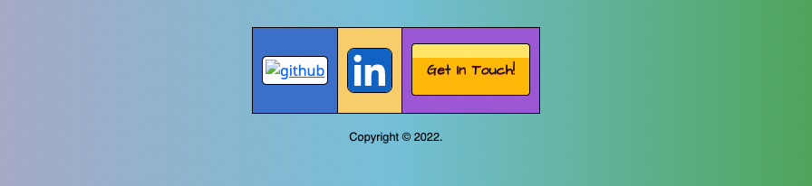
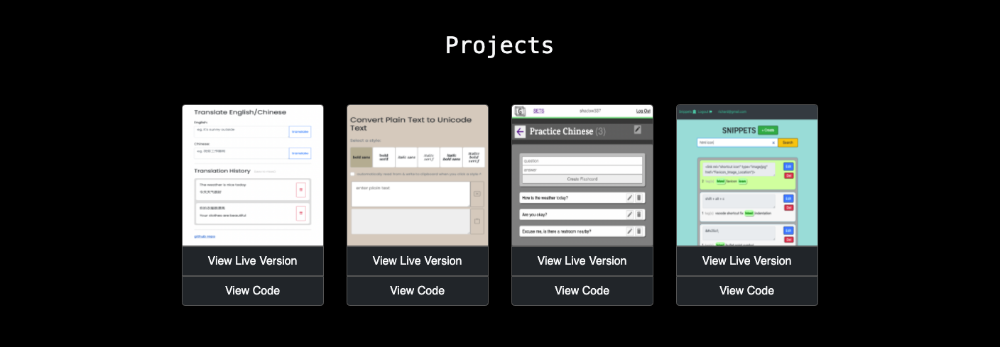
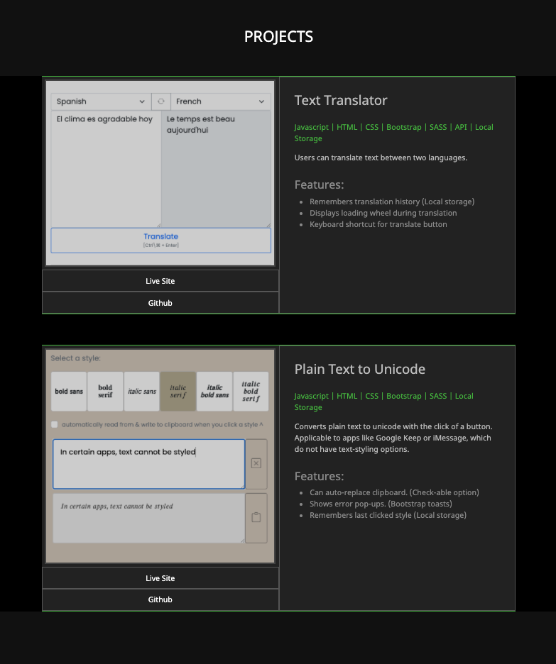
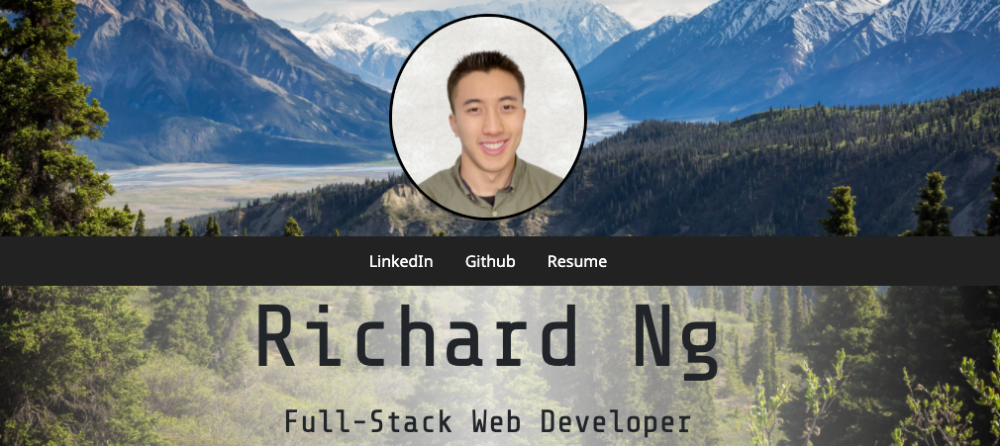
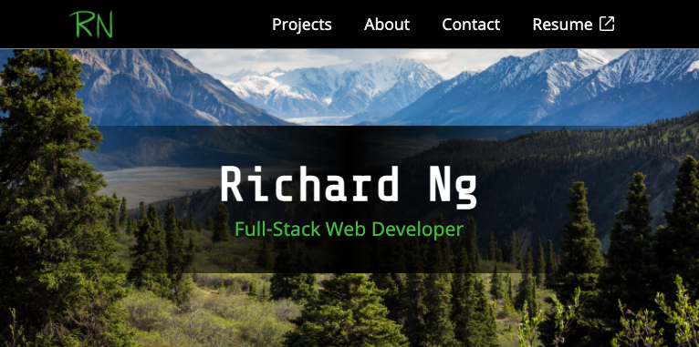
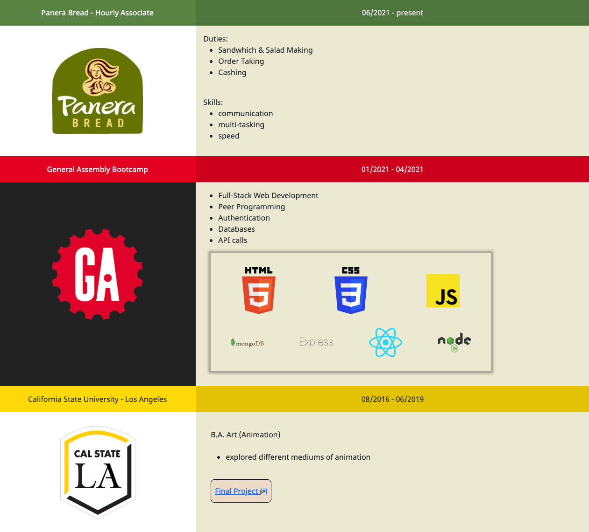
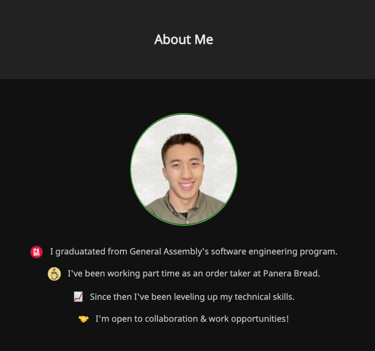
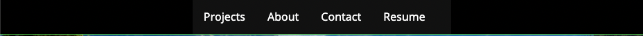
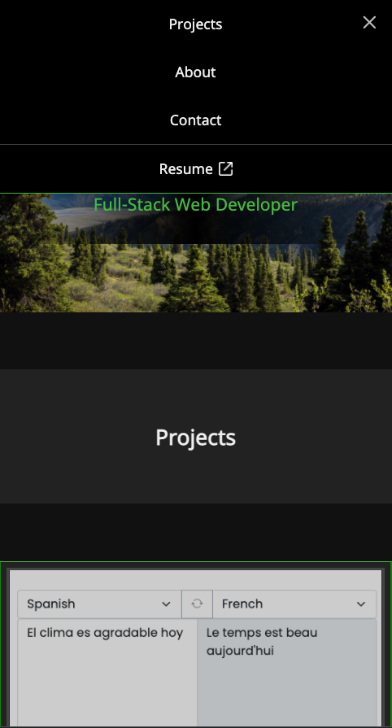
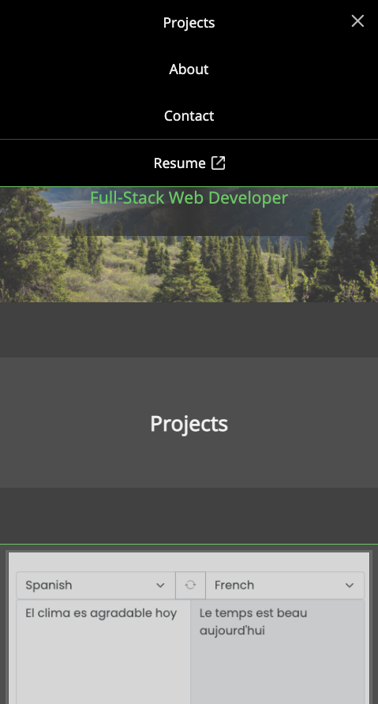

# [Personal Website](https://www.richard-ng.com/)

# Description

This is the repo for my responsive website! No Boostrap--just custom CSS.

# Technologies

Javscript, HTML, CSS, SASS

# Next Steps

- add skills section
- add more projects
- header:
  - modernize
  - add paralax effect to image background
- make css use min-width media queries instead of max-width
- normalize spacing of nav links on larger widths
- add email form
- when email is clicked, show 'copy to clipboard' and 'open in mail app' options
- javscript fun:
  - make eyes blink when portrait is clicked
  - make eyes follow mouse
- add animation to something
- ~~add about me section~~
  - update based on scroll location
- ~~add navigation bar~~
- ~~improve contact me section~~

# Evolution

## Old Contacts

## New Contacts

## Old Projects

## New Projects

## Old Header

## New Header

## Old About

## New About

## Old Navbar

## New Navbar

## Before White Overlay

## After White Overlay

